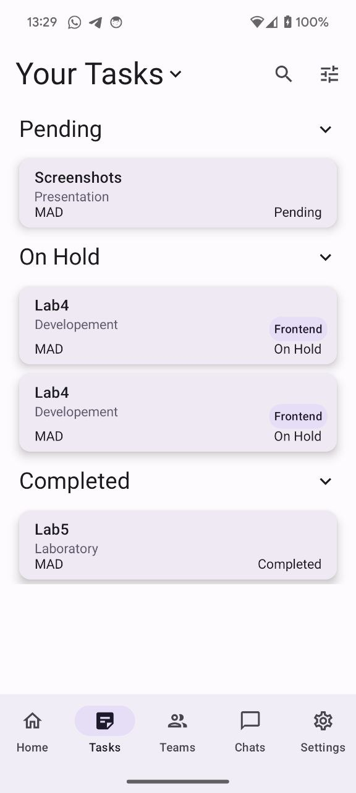
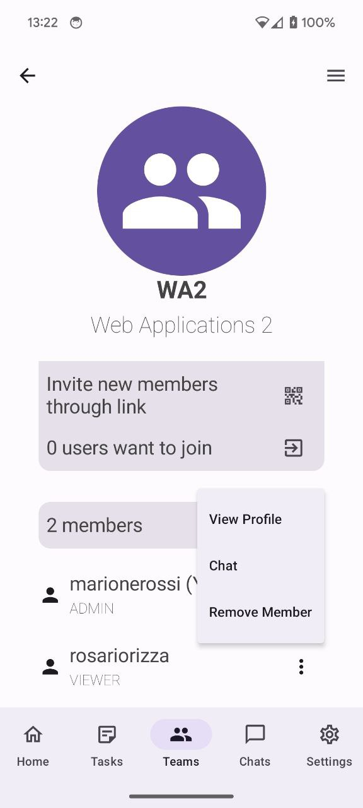
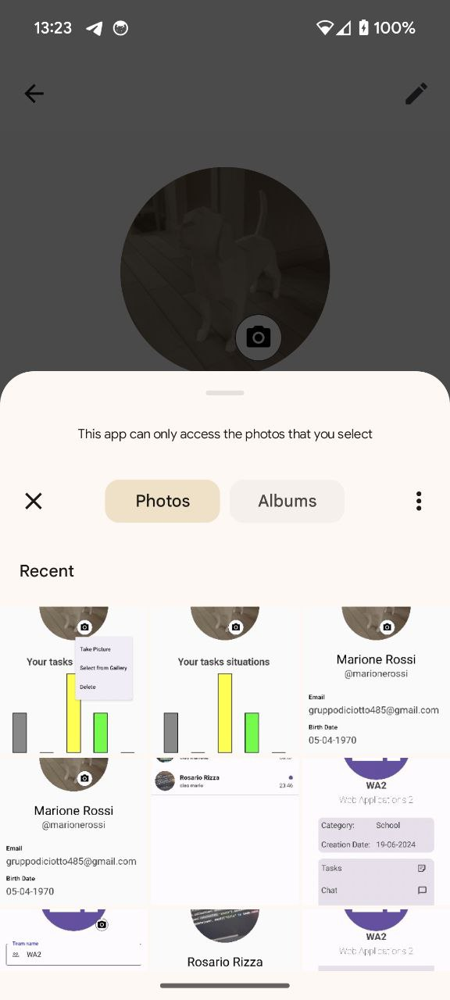

# BeGroup Application
Manage your team workflow seamlessly with BeGroup.

## Login

Login with your Google Account:

## Homescreen

In your homescreen you can see your task and the unread messages

## Task

List of tasks

In the task list screen you can see the tasks, group them by fields, sort them and allpy filters

Task Details and editing

You can create task and edit them, adding also some repetition

Task Features

Tasks have comments and history

## Team

Your team, with filters and direct access to the main features

Team detail

Add new members to team

Edit Team

Team performances shows how your team is doing

Add and remove team tags

Join group by link, pasting it into the browser

Accept join request from people clicking the join link

## Chat

Have all your chats in one screen

Add new chats with other people in the app

Go to tagged profile

## User Profile

User profile

Change the profile picture of you account, with camera and gallery

